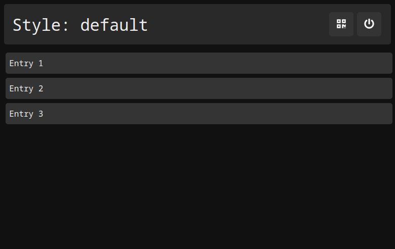
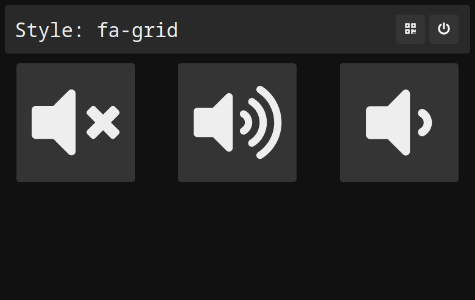
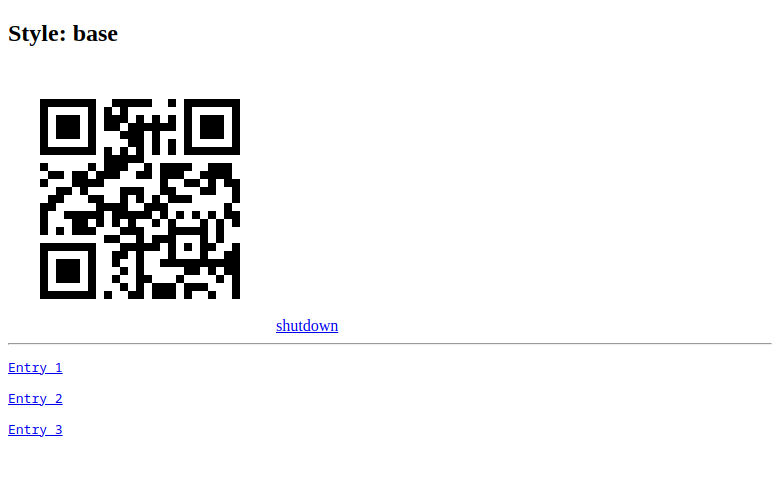

# thqm-styles

This repository contains the style templates for [`thqm`](https://github.com/loiccoyle/thqm-rs).

## 🖼 Gallery

- [`default`](styles/default): the default style
  
- [`fa-grid`](styles/fa-gtid): `fontawesome` icon grid
  
- [`base`](styles/base): a bare bones style, which can be used as a base for your own styles
  

## 🎨 Style structure

A `thqm` style should have the following structure:

| Path                               | Usage                                                                                                          |
| ---------------------------------- | -------------------------------------------------------------------------------------------------------------- |
| `{style_name}/`                    | The name of the style is determined by the name of the style's root folder in the user data directory.         |
| `{style_name}/template/index.html` | This file is the [`tera`](https://docs.rs/tera/latest/tera/) template which will be used to generate the menu. |
| `{style_name}/static/`             | This directory holds static resources such as `css`, `js` and image files.                                     |

The style [`tera`](https://docs.rs/tera/latest/tera/) template options are documented [here](https://docs.rs/thqm/latest/thqm/styles/struct.TemplateOptions.html).

## 👤 Contributing

If you want to contribute your own styles, please feel free to open a PR.
